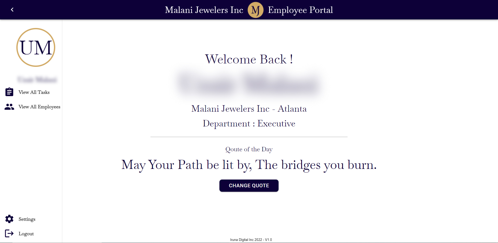

# Malani Employee Portal
## Description
Employee portal created for Malani Jewelers Inc. A web based employee portal for administration to manage employees seamlessly. Features included; auto renewing daily tasks, Announcement Panel, Employee Review, Time Off and scheduling

Live Link: [Malani Employee Portal](https://github.com/alifaizan786-op/Malani Employee Portal)
---
## Table of Contents
- [Installation](#installation)
- [Usage](#usage)
- [Credits](#credits)
- [License](#license)
- [Questions](#questions)
---
## Installation
- Update Mongo DB URI in the server > config > connections.js
-  Run npm run build
-  Run npm run start

## Usage
The soles usuage for this project is to streamline day to day process of a business enviroment

## Tests

## Credits
### People
- Farid Virani - https://github.com/faridvirani

### Resources
- https://stackoverflow.com/
-  https://mongoosejs.com/docs/
-  https://reactjs.org/
-  https://mui.com/

## License

## Questions
Github UN: alifaizan786-op - [alifaizan786-op](https://github.com/alifaizan786-op)
You can contact me via email by emailing faizan.ali@irunadigital.com with your questions
    
    